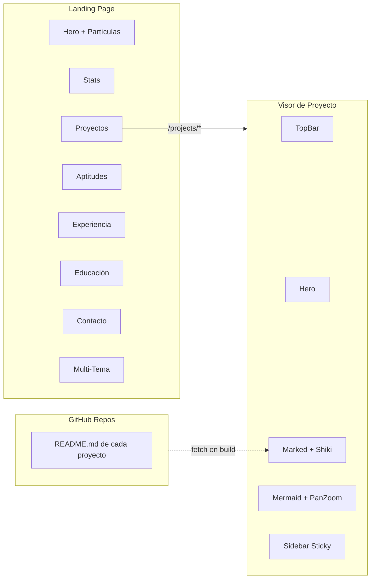

<div align="center">

<pre>
██████╗  ██████╗ ██████╗  ███████╗ ██████╗ ██╗     ██╗ ██████╗ 
██╔══██╗██╔═══██╗██╔══██╗ ██╔════╝██╔═══██╗██║     ██║██╔═══██╗
██████╔╝██║   ██║██████╔╝ █████╗  ██║   ██║██║     ██║██║   ██║
██╔═══╝ ██║   ██║██╔══██╗ ██╔══╝  ██║   ██║██║     ██║██║   ██║
██║     ╚██████╔╝██║  ██║ ██║     ╚██████╔╝███████╗██║╚██████╔╝
╚═╝      ╚═════╝ ╚═╝  ╚═╝ ╚═╝      ╚═════╝ ╚══════╝╚═╝ ╚═════╝ 
</pre>

### *Porfolio personal — desarrollado con Astro, Tailwind CSS y animaciones inmersivas*

[](https://astro.build) [](https://tailwindcss.com) [](https://www.typescriptlang.org/) [](https://shiki.style/) [](https://marked.js.org/) [](https://mermaid.js.org/) [](https://alvarosac99.github.io/Porfolio/)

 [Ver Portfolio en vivo](https://zenithseed.dev) •  [Repositorio](https://github.com/alvarosac99/Porfolio)

</div>

---

##  Tabla de Contenidos
- [Sobre el Proyecto](#sobre-el-proyecto)
- [Características Principales](#características-principales)
- [Demo y Capturas](#demo-y-capturas)
- [Stack Tecnológico](#stack-tecnológico)
- [Arquitectura](#arquitectura)
- [Inicio Rápido](#inicio-rápido)
  - [Requisitos Previos](#requisitos-previos)
  - [Instalación](#instalación)
  - [Scripts Disponibles](#scripts-disponibles)
- [Estructura del Proyecto](#estructura-del-proyecto)
- [Sistema de Temas](#sistema-de-temas)
- [Páginas de Proyectos](#páginas-de-proyectos)
- [Despliegue](#despliegue)
- [Licencia](#licencia)

---

<a name="sobre-el-proyecto"></a>

##  Sobre el Proyecto

> Este porfolio es mi carta de presentación digital. Lo he diseñado para compartir mi CV, mostrar mis proyectos y dejar claro quién soy como desarrollador. La idea era construir algo que no fuese un PDF aburrido, sino una experiencia interactiva que refleje mi forma de trabajar y mi obsesión por los detalles.

He construido todo desde cero con **Astro** como generador estático (0 JavaScript del framework en el cliente), **Tailwind CSS v4** para el diseño y componentes `.astro` modulares. La estética está inspirada en terminales e IDEs porque es donde paso la mayor parte de mi tiempo — tipografías monoespaciadas, micro-animaciones, partículas interactivas y un sistema multi-tema que puedes alternar en tiempo real. Cada proyecto tiene su propia página de detalle que renderiza directamente el `README.md` de su repositorio en GitHub.

---

<a name="características-principales"></a>

##  Características Principales

-  **Sistema Multi-Tema** — 4 temas intercambiables en tiempo real (Console Dark, Console Light, Warm Dark, Warm Light) con persistencia vía `localStorage`.
-  **Fondo de Partículas Interactivo** — Animación Canvas con efecto "Particle Constellation" que reacciona al movimiento del cursor en tiempo real.
-  **Diseño 100% Responsive** — Sistema de padding fluido por escalones (`sm → md → lg → xl`) para adaptación perfecta desde móviles hasta monitores ultrawide.
-  **Visor de README Dinámico** — Renderizado en tiempo de compilación del `README.md` de cada proyecto directamente desde GitHub con `marked`, `highlight.js` y soporte para diagramas `Mermaid`.
-  **Efectos Parallax 3D** — Tarjetas de proyecto con parallax interactivo, sprites animados y efectos hover con multiplicadores de escala individuales.
-  **Navegación Sticky + Sidebar** — Header fijo con scroll suave y menú lateral sticky en las páginas de proyecto con detección de sección activa vía `IntersectionObserver`.
-  **Grafos Mermaid Interactivos** — Diagramas de arquitectura con pan-zoom (`svg-pan-zoom`), cambio dinámico de tema claro/oscuro y cursores drag nativos.
-  **Syntax Highlighting Avanzado** — Coloreado de código nativo en bloques del README usando `shiki` con _Dual Themes_ (`poimandres` / `min-light`) reactivos al tema general.

---

<a name="demo-y-capturas"></a>

##  Demo y Capturas

| Vista | Descripción |
|:---:|:---|
| **Landing** | Hero con partículas, estadísticas y presentación del perfil profesional |
| **Proyectos** | Grid con tarjetas 3D parallax (GameS, VPS, Minecraft Server) |
| **Detalle** | Visor README con sidebar sticky, diagramas Mermaid adaptativos, tablas scrolleables y Shiki syntax highlighting |
| **Aptitudes** | Panel de tecnologías con iconos SVG categorizados |
| **Temas** | 4 combinaciones dark/light con transiciones suaves |

---

<a name="stack-tecnológico"></a>

##  Stack Tecnológico

###  Frontend

| Tecnología | Versión | Uso |
|:---|:---:|:---|
| **Astro** | 5.x | Framework SSG — genera HTML estático con 0 JS del framework en el cliente |
| **Tailwind CSS** | 4.x | Sistema de diseño utility-first con plugin `typography` para prose |
| **TypeScript** | 5.x | Tipado estático en el frontmatter de los componentes `.astro` |
| **JetBrains Mono** | — | Tipografía monoespaciada principal (títulos, acentos, código) |
| **IBM Plex Mono** | — | Tipografía secundaria para cuerpo de texto y descripciones |

###  Renderizado de Contenido

| Librería | Versión | Uso |
|:---|:---:|:---|
| **Marked** | 17.x | Parser de Markdown a HTML con renderers personalizados |
| **Shiki** | 1.x | Coloreado de código avanzado con Dual Themes (`poimandres` y `min-light`) |
| **Mermaid** | 10.x | Diagramas de arquitectura y flujos renderizados desde código |
| **svg-pan-zoom** | 3.6.x | Controles interactivos de zoom/pan sobre los grafos SVG |

###  Diseño y Animaciones

| Elemento | Tecnología |
|:---|:---|
| **Partículas** | Canvas API nativo — efecto Constellation reactivo al cursor |
| **Parallax 3D** | CSS `transform: perspective()` + `rotateX/Y()` vía JS |
| **Micro-animaciones** | CSS `@keyframes` (float, fade-in, scale) + `transition` |
| **Iconos** | Iconify API (MDI set) — SVG inline dinámicos |

---

<a name="arquitectura"></a>

##  Arquitectura



---

<a name="inicio-rápido"></a>

##  Inicio Rápido

<a name="requisitos-previos"></a>

### Requisitos Previos

| Herramienta | Versión Mínima |
|:---|:---:|
| **Node.js** | 18.x o superior |
| **npm** | 9.x o superior |
| **Git** | 2.x |

<a name="instalación"></a>

###  Instalación

```bash
# 1. Clonar el repositorio
git clone https://github.com/alvarosac99/Porfolio.git

# 2. Acceder al directorio
cd Porfolio

# 3. Instalar dependencias
npm install

# 4. Iniciar servidor de desarrollo
npm run dev
```

> El servidor se levantará por defecto en `http://localhost:4321/`. Astro buscará automáticamente un puerto libre si el 4321 está ocupado.

<a name="scripts-disponibles"></a>

###  Scripts Disponibles

| Comando | Descripción |
|:---|:---|
| `npm run dev` | Inicia el servidor de desarrollo con HMR (Hot Module Replacement) |
| `npm run build` | Genera la build de producción estática en `./dist/` |
| `npm run preview` | Previsualiza la build de producción localmente |
| `npm run astro` | Acceso directo al CLI de Astro |

---

<a name="estructura-del-proyecto"></a>

##  Estructura del Proyecto

```
Porfolio/
├── public/
│   └── assets/
│       ├── games/            # Imágenes del proyecto GameS
│       ├── minecraft/        # Imágenes del proyecto Minecraft
│       └── zenith/           # Imágenes del servidor VPS
├── src/
│   ├── components/
│   │   ├── BackgroundAnimation.astro   # Canvas de partículas
│   │   ├── Header.astro                # Header principal
│   │   ├── Hero.astro                  # Sección Hero
│   │   ├── Projects.astro              # Grid de proyectos
│   │   ├── Skills.astro                # Panel de aptitudes
│   │   ├── Experience.astro            # Timeline de experiencia
│   │   ├── Education.astro             # Formación académica
│   │   ├── Contact.astro               # CTA de contacto
│   │   ├── Footer.astro                # Footer principal
│   │   ├── Stats.astro                 # Contadores
│   │   ├── ThemeSwitcher.astro         # Selector de temas
│   │   └── console/
│   │       ├── ConsoleHeader.astro     # Header tema consola
│   │       ├── ConsoleHero.astro       # Hero tema consola
│   │       ├── ConsoleProjects.astro   # Tarjetas 3D parallax
│   │       ├── ConsoleSkills.astro     # Aptitudes estilo terminal
│   │       ├── ConsoleExperience.astro # Experiencia laboral
│   │       ├── ConsoleEducation.astro  # Formación
│   │       ├── ConsoleContact.astro    # Contacto
│   │       ├── ConsoleFooter.astro     # Footer consola
│   │       ├── ConsoleStats.astro      # Stats consola
│   │       ├── ThemeDropdown.astro     # Panel multi-tema
│   │       ├── ThemeTrigger.astro      # Botón trigger
│   │       ├── TopBar.astro            # Barra superior GameS
│   │       ├── McTopBar.astro          # Barra superior Minecraft
│   │       ├── DocHero.astro           # Hero del proyecto GameS
│   │       ├── McHero.astro            # Hero del proyecto Minecraft
│   │       ├── DocFooter.astro         # Footer subpáginas (genérico)
│   │       └── Content.astro           # Contenido estático GameS
│   ├── layouts/
│   │   └── ConsoleLayout.astro         # Layout principal
│   ├── pages/
│   │   ├── index.astro                 # Landing page
│   │   └── projects/
│   │       ├── games.astro             # Visor README de GameS
│   │       └── minecraft.astro         # Visor README de Minecraft
│   └── styles/
│       └── global.css                  # Variables CSS, temas, resets
├── docs/
│   └── README.md                       # Documentación interna del proyecto
├── package.json
├── astro.config.mjs
├── tsconfig.json
└── README.md                           # ← Este archivo
```

---

<a name="sistema-de-temas"></a>

##  Sistema de Temas

El porfolio implementa un sistema de **4 temas** gestionados mediante variables CSS y el atributo `data-theme` en el `<html>`:

| Tema | Atributo | Fondo | Acento |
|:---|:---|:---|:---|
| **Console Dark** | `console-dark` | `#0C0C0C` | Turquesa `#00D4AA` |
| **Console Light** | `console-light` | `#FFFFFF` | Naranja `#E8612A` |
| **Warm Dark** | `warm-dark` | `#0E0C10` | Naranja `#FF7A42` |
| **Warm Light** | `warm-light` | `#FAF8F6` | Naranja `#E8612A` |

### Persistencia
La preferencia se guarda en `localStorage` bajo la clave del tema activo. Al recargar, el script inline del `<head>` aplica el tema antes del primer render para evitar el flash de contenido sin estilar (FOUC).

### Implementación
```
ThemeDropdown.astro     →  Panel desplegable con preview de cada tema
ThemeTrigger.astro      →  Botón sol/luna que abre el panel
global.css              →  Variables CSS (--color-*) bajo [data-theme="*"]
```

---

<a name="páginas-de-proyectos"></a>

##  Páginas de Proyectos

Cada proyecto tiene su propia ruta (`/projects/{nombre}`) con un visor completo que:

1. **Descarga el `README.md`** del repositorio GitHub en tiempo de compilación (`fetch` + `marked`).
2. **Reescribe rutas relativas** de imágenes y enlaces para que apunten al raw de GitHub.
3. **Extrae las cabeceras H2** para generar un **sidebar de navegación** con detección de sección activa.
4. **Colorea bloques de código** de forma inteligente con `shiki` y sus _Dual Themes_ (`poimandres` para oscuros, `min-light` para claros) totalmente sincronizados.
5. **Renderiza diagramas Mermaid** con `mermaid.render()` manual, controles de zoom pan-zoom y **re-renderizado reactivo** al cambiar el tema.
6. **Manejo responsive completo** con soporte para scroll horizontal en tablas y bloques anchos de código sin romper el diseño del visor.

| Proyecto | Ruta | Repositorio |
|:---|:---|:---|
| **GameS** | `/projects/games` | [alvarosac99/GameS](https://github.com/alvarosac99/GameS) |
| **Minecraft Server** | `/projects/minecraft` | [alvarosac99/mc-web](https://github.com/alvarosac99/mc-web) |

---

<a name="despliegue"></a>

##  Despliegue

### Generación de Build

```bash
# Generar build de producción
npm run build

# Previsualizar localmente
npm run preview
```

La build se genera en el directorio `./dist/` como HTML estático puro. Se puede servir desde cualquier proveedor de hosting estático:

| Proveedor | Comando / Método |
|:---|:---|
| **GitHub Pages** | Push a rama `gh-pages` o configurar Actions |
| **Netlify** | Conectar repositorio → Build: `npm run build` → Publicar: `dist` |
| **Vercel** | Importar proyecto → Framework: Astro → Deploy automático |
| **VPS propio** | `npm run build` + servir `dist/` con Nginx/Apache |

### Variables de Entorno

El proyecto **no requiere variables de entorno**. Los READMEs de los proyectos se descargan de repositorios públicos de GitHub durante el build.

---

<a name="licencia"></a>

##  Licencia

Este proyecto es software **privado** de uso personal. Todos los derechos reservados © 2026 Álvaro Sebastián Acosta Cortizas.

---

<div align="center">

###  Si este proyecto te pareció interesante o útil, ¡no dudes en dejar tu estrella!

<br/>

*Hecho por Sebas *

[](https://github.com/alvarosac99)
</div>
